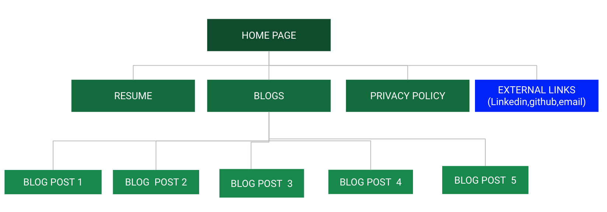
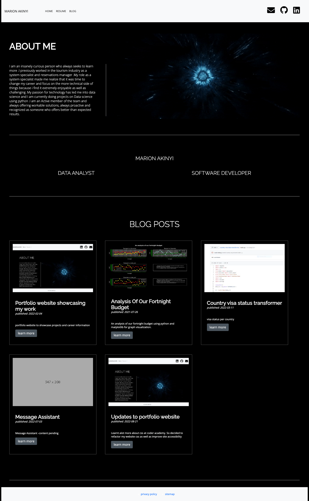
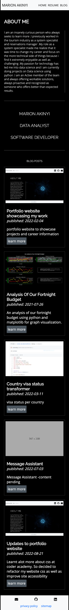

# PORTFOLIO DOCUMENTATION

## link to published portfolio website

[My portfolio website]()

## link to my GitHub repo

[Github](https://github.com/marie-debug/T1A2---Portfolio)

## Youtube presentation

[Youtube presentation]()

## Purpose & target audience

The purpose of this website is  to provide an online portfolio that provides information about me, my skills, interests, professional knowledge and a showcase of my work. To potential employers in the IT field.

## Functionality / features

**Homepage:**  

1. Contact: Navbar containing links to my social media website making it easier to users i.e employers to connect with me..
2. About me :with my bio and an image of a wormhole to bring color and appeal visually to users.
3. Blog-post cards : Highlights my projects in terms of a brief description and an image of project and when clicked takes the user to a blog page with more detail

**Projects/blog post Page:** Blog pages giving detail description of worked on projects and dates published 

**Resume Page:** A page with my resume and a download button that users can easily use to download my resume to their website

**Privacy policy Page :** A html page that shows users who visit my page that their data is protected.

**Responsiveness:** Website is fully responsive to create accessibility to users across different devices
**Accessibility** The website is accessible to make it easier to navigate to information needed

## Sitemap

## Tech stack

1. Html
2. Css
3. Hosted on Netlify

## Screenshots

### Desktop

### Tablet

### Mobile

